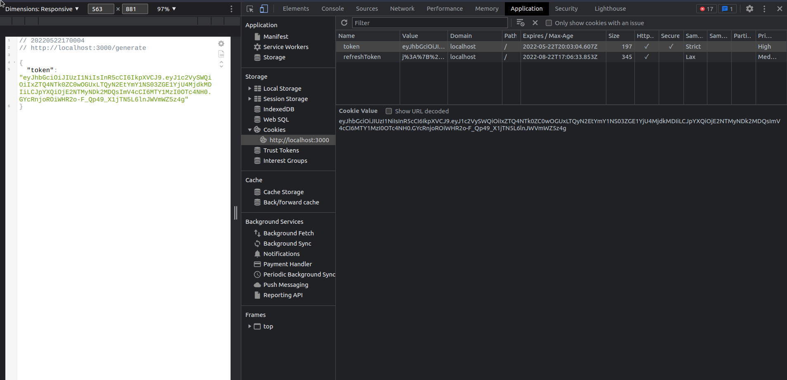

# A simple cookie generator

A simple project to test token generator from server side
This server generate a token and a cookie, and send from header to client set on browser.

## Test it

Run the project

```bash

$ yarn install

$ yarn start

```

Open browser on localhost:3000/generate

Open your browser on application > cookies

Now you can check this cookie 

Open browser on localhost:3000/check

